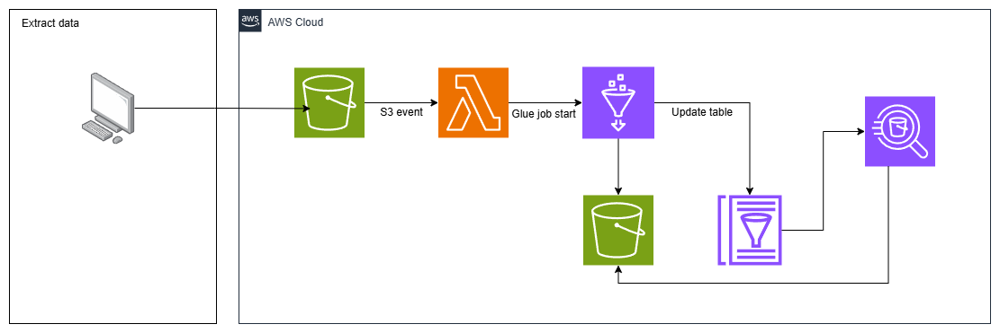

# Data Pipeline – Nasdaq100

## 📘 Descrição

Este projeto implementa uma **pipeline de dados automatizada** para o índice **Nasdaq-100**, utilizando serviços da **AWS** como S3, Lambda e Glue.  
O objetivo é extrair dados financeiros, processá-los e mantê-los atualizados de forma contínua.

## ⚙️ Fluxo da Arquitetura

1. O **notebook** realiza a **extração dos dados** (Via biblioteca yfinance) e **envia os arquivos para o S3**.  
2. Quando uma nova carga sobe para o S3, uma **função Lambda** é acionada automaticamente.  
3. A Lambda **dispara um job do AWS Glue**, que:
   - Refina os dados e os **salva novamente no S3**;  
   - **Atualiza a tabela** no **Glue Data Catalog**.  
4. Com isso, os dados ficam disponíveis para **consulta via Athena**.

## 🧱 Estrutura do Projeto

.
├── Extract_data_ifinance.ipynb # Extração e envio dos dados ao S3
├── lambda_function.py # Disparo automático do job do Glue
├── glue_job.py # Processamento e atualização do catálogo
├── arquitetura.drawio.png # Diagrama da arquitetura
└── README.md

## 🧰 Tecnologias Principais

- **AWS S3** – Armazenamento de dados brutos e refinados  
- **AWS Lambda** – Automação da execução  
- **AWS Glue** – Transformação e catalogação dos dados  
- **Python / Jupyter Notebook** – Extração inicial dos dados  

## 🚀 Próximos Passos

- Melhorar a monitoração e logs da pipeline  
- Adicionar validações de qualidade dos dados  
- Automatizar o agendamento da extração  